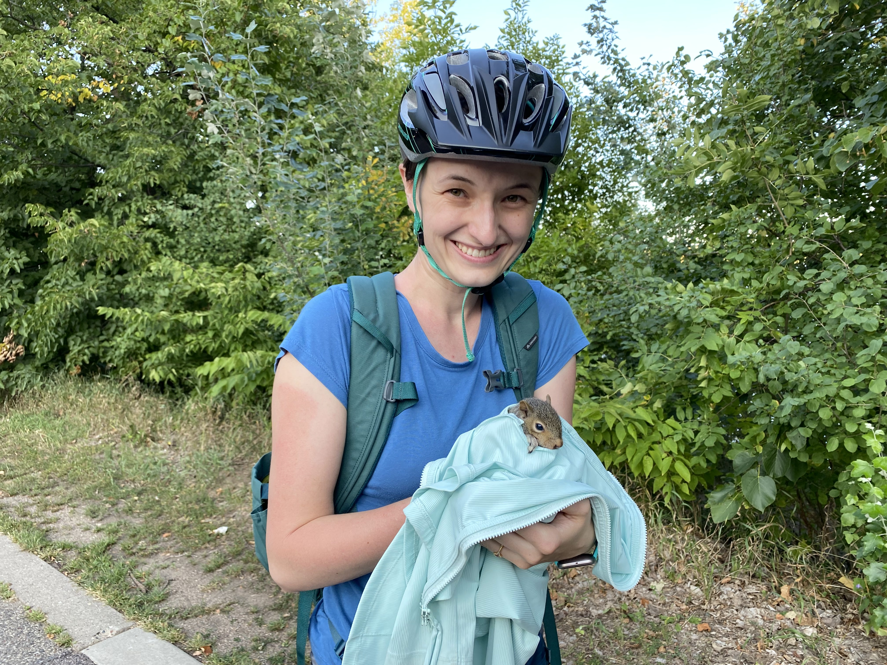
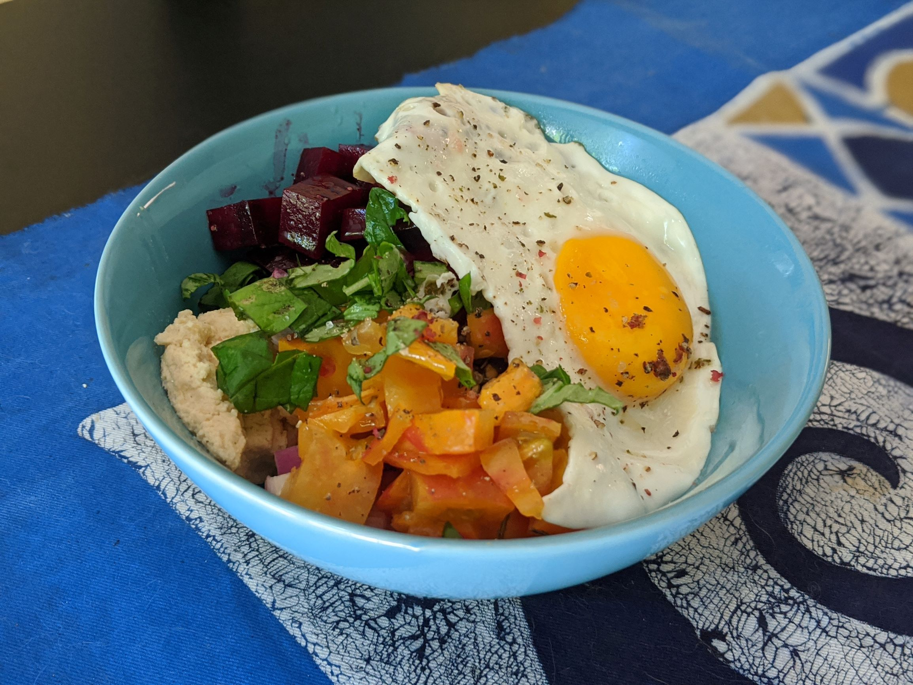

I've pushed toward a more conscious and sustainable lifestyle, which aligns well with my desire to live simply and intentionally. While your ideal life may be very different from mine, maybe these resources will help bring you some perspective and encourage you to reflect on what's really important to you. Determining your priorities is an important part of setting up a healthy relationship with money.

## 1. Mr. Money Mustache

Discovering the [Mr. Money Mustache](https://www.mrmoneymustache.com/) blog is where my money awareness really started in earnest. MMM is the original financial independence blogger. His site is full of inspiration and tools toward becoming less dependent on stuff and restructuring your life so that you’ll have more time to do the things you want. He takes an extreme approach that may be too much for most people, but my takeaways boiled down to two things: Build the life that you want, then save for that lifestyle without increasing spending (known as lifestyle creep). Once my husband and I found a balance between our lifestyle and budget, anything extra went toward savings. Any pay raises or windfalls were immediately invested, which helped us save for the future. My favorite activities are low-cost or free, such as biking to the park for a picnic, having friends over for a home-cooked meal, reading a book, or following a watercolor tutorial on YouTube. I've learned that living a satisfying and fulfilling life doesn't have to be expensive.

These savings and our sustainable budget allowed us to take a sabbatical from work and move to Minnesota for a better quality of life. We wouldn't have been able to do this without those savings. I needed a break from work burnout and was able to prioritize my mental health without the stress of a job. We didn't have work lined up in Minnesota but knew it was where we wanted to be and that it was time to leave Texas. We thought we were saving for retirement, but having those savings gave us the opportunity to change our lives for the better right now.

_Learn more on my [about](/about) page._

We still travel and go out for meals. We are just deliberate, and we find cost-effective options where it matters. We're happy to fly on budget airlines with only a personal item since that carry-on fee can instead go towards a meal at our destination. I always carry a snack bar in my fanny pack so that I don't impulsively spend money on a crummy overpriced pastry when my blood sugar drops. Instead, I can use that money to buy a treat when it's worth it and I'd enjoy the purchase.

Mr. Money Mustache taught me to prioritize what really matters. For me, that's quality time with friends and family and having free time rather than things. Your priorities may be different, but creating a sustainable budget will help you with your goals, whatever they might be.

## 2. You Need a Budget

My husband and I started using the budgeting app [You Need a Budget (YNAB)](https://www.ynab.com/) back in 2015 and still use it today. YNAB's philosophy is to take an active approach to budgeting. Rather than seeing how much you spent at the end of the month, you proactively assign money to categories. When you have income, every dollar goes into a budget or "envelope" so that you have enough for everything that matters.

I grew up very frugal and was quite stingy with money. This affected friendships and caused a lot of stress as I deliberated every purchase. When I dined out with friends, they'd split an appetizer, but I'd opt out just to save a few bucks. This caused more stress than it was worth and made it hard to enjoy these shared experiences.

Thanks to YNAB, I have a much healthier relationship with money. Do I still deliberate purchases to make sure they're worth it? Yes. But now, I don't worry about if splitting an appetizer will take money away from something important. Instead of looking at my overall account balance - a nebulous amount of money - to determine if I can make a purchase, I look at individual budget categories such as groceries or dining out. I can spend freely without worrying about whether I'm taking money away from savings goals, bills, or living expenses. If there's any money left over after filling out the important categories, I can budget towards travel or spending money, so when the opportunity arises, I know right away if I have enough money to do it without worrying about the consequences on daily life. It also allows me to budget ahead to future months, which provides a buffer like an emergency fund. The freedom I feel knowing that money is there for purchases is unmatched. I can say "yes" to the appetizer and enjoy the evening.

## 3. _The Life-Changing Magic of Tidying Up_ by Marie Kondo

When your life is full of unnecessary stuff, your brain is, too. I read [Marie Kondo's book](https://bookshop.org/p/books/the-life-changing-magic-of-tidying-up-lib-e-the-japanese-art-of-decluttering-and-organizing-marie-kondo/16668398?ean=9781607747307) and took the opportunity to part with anything that didn’t “spark joy.” As a result, I have a more positive outlook on life and am less stressed. I used to browse websites for dresses and shoes - material items that might bring me temporary enjoyment but that I'd only wear a few times. Now, I enjoy finding new art supplies or flavored olive oil that I'll use up, borrowing books from the library, and sharing experiences with family and friends.

My husband and I have also implemented a no-gift policy with our family and it's reduced stress so much. Any gifts given are experiences or something consumable, like a trip to the botanical garden or my husband's homemade Pfeffernüsse cookies. We no longer receive things that we won't need or use, and don't need to find gifts for others. We've found that there are other ways for us to show that we care - usually through time spent together.

## 4. _Animal, Vegetable, Miracle: A Year of Food Life_ by Barbara Kingsolver

At the start of the pandemic, I picked up [_Animal, Vegetable, Miracle_](https://bookshop.org/p/books/animal-vegetable-miracle-tenth-anniversary-edition-a-year-of-food-life-barbara-kingsolver/6439160?ean=9780062653055) and was captivated by Kingsolver's stories of eating locally for a year. She grew vegetables, made her own cheese and canned products, raised chickens for eggs, and supported local vendors for grains and other goods. While I haven't gone as far as Barbara, I love to support local vendors as it keeps money in the community and reduces my carbon footprint.

I've always had a curiosity surrounding food and enjoy having some constraints to provide a challenge when cooking. I use dried beans and grains to save money, only eat meat occasionally, buy fresh produce from the farmer's market, and my husband loves baking fresh bread. This has also reduced our food waste, as I've gotten very good at creating meals from leftover ingredients. We'll have friends over to make tamales or try to replicate something from our favorite restaurant.

I understand that not everyone has the time to cook meals, or you may not enjoy cooking at all or find ingredients cost prohibitive. I plan to write some blog posts about small and accessible changes to help reduce your food budget while still enjoying what you eat.

[Read more about my early simple cooking adventures on my spontaneous living blog, Unplan-It Earth](https://unplanitearth.com/cooking-in-lockdown/).

## 5. _Strong Towns: A Bottom-Up Revolution to Rebuild American Prosperity_ by Charles L Marohn Jr

If you want to know why we picked Minneapolis over everywhere else in the United States, it's because of this book. I discovered the Strong Towns movement through the YouTube channel [Not Just Bikes](https://www.youtube.com/watch?v=uxykI30fS54) when he very succinctly captured the stress and frustration I felt live in a car-dependent urban environment. I then read [_Strong Towns_](https://www.strongtowns.org/strong-towns-book), which is written by a former civil engineer who realized that current established urban planning practices are draining our cities of resources and isolating our communities. Ever wonder why European cities feel so welcoming compared to American suburban sprawl? This book explains it all. And just as a warning, once you've been "orange-pilled," you can't go back.

While Minneapolis isn't perfect, it's filled with parks and nature, slow tree-lined streets where cars are limited to 25mph, and a massive network of dedicated bike infrastructure. Single-family homes are in neighborhoods with restaurants, small apartment buildings, stores, and gathering places. People of different income levels can live in the same area, creating a vibrant and thriving community where ideas can be shared and folks support one another and know their neighbors. I feel so much less lonely and isolated here compared to my car-dependent suburban home in Austin. I'd give up a big fenced-in yard and two-car garage for community, parks, and bakeries anytime.

## Finding Your Philosophy

These resources are the ones that have defined my personal philosophy of simple living and enjoying the present. What influences have you come across that you keep thinking about? Are you living your life in a way that you'd like to change? It's not too late - now is the best time to rethink how you're living and prioritize what really matters to you.

