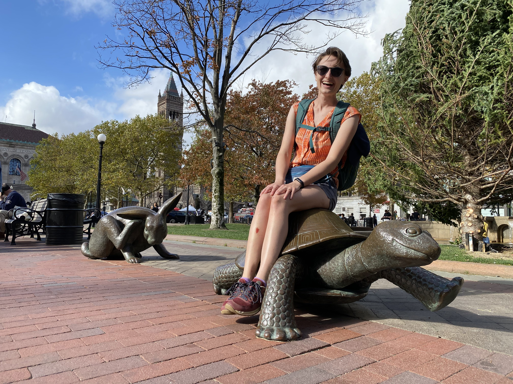
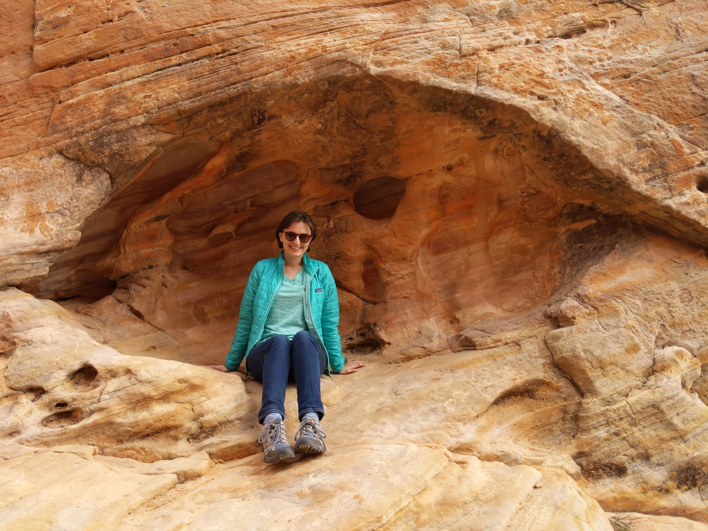

## Hi, I'm Annie.

I'm a personal finance nerd and former mechanical engineer and design studio lead. I enjoy living a simple life with my husband and two cats in Minneapolis, Minnesota. I spend my days sketching at the local rock garden, biking to the grocery store for that night's dinner ingredients, bouldering with friends, and savoring the little things in life.

But as David Byrne asked, <a target="_blank" rel="noopener" href="https://www.youtube.com/watch?v=5IsSpAOD6K8&pp=ygUSb25jZSBpbiBhIGxpZmV0aW1l">Well, how did I get here?</a>

Life is a funny thing - it never works out the way one expects. I grew up in the California Bay Area, went to school in New Jersey, lived in Austin, Texas for almost 8 years, and now live in the Midwest. After living in four very different places, I've learned a lot about what really matters in life, the differences between people, and the things that everyone has in common. Let me share my story, and if it resonates with you, [let's talk](/contact).

## Questioning the Expected Path: Is this really the only way?

I was academically driven from a young age. I really liked school, and I was good at it. It was the general expectation that I'd go to a good college and get a well-paying job on my way to a productive career. I didn't really question this, as it was what everyone around me was also doing, and it made sense in my worldview. I wasn't much of a risk-taker. However, I was also fortunate to have parents who quit the rat race and worked from home during my childhood, so I knew that there were other ways to live life.

After getting a degree in mechanical engineering, my now-husband and I moved to Austin, Texas to start our careers. But after so many years of working to get to the top academically, neither of us wanted to do it anymore. Was this all there was to life? The constant grind of moving up the ladder and devoting one's waking hours to a career? Spending all day in an office and contributing to the endless cycle of consumption?

**One day, we had a conversation that redefined everything.**

"If we have a kid someday and someone needs to stay home, which one of us would want to keep working?"

The answer was somewhat surprising - or maybe society just makes us think that it's unusual because it seems like there's no other way.

**Both of us wanted to stay home, and neither one of us wanted to keep working full-time.** I had loved having both of my parents at home growing up and wanted that for my offspring as well, and my husband wanted that too. But was this even possible if we wanted to have a kid in the next decade?

## Making it Possible: Restructuring our Finances

We made it our goal to structure our finances so that we could enjoy the present, but also save for the future. We are very lucky that we had well-paying jobs, lived in a relatively affordable area (at the time), and had no debt. But we were also incredibly deliberate with our budget and prioritized a few activities that made us happy, while saving and investing the rest.

During this time we also discovered the FIRE (Financial Independence Retire Early) movement. I'll avoid getting into the weeds here, but the concept is that by saving a larger percentage of your income and not falling victim to lifestyle creep, your savings can grow to the point where you have enough to live on sooner than traditional retirement age. _Mr. Money Mustache has a great post about the math [here.](https://www.mrmoneymustache.com/2012/01/13/the-shockingly-simple-math-behind-early-retirement/)_

While we decided it was infeasible to stop working entirely before having offspring, we compromised on having enough buffer saved up to spend time with our child during their early years, and working part-time to supplement our savings. We settled in for the long haul and worked our engineering jobs for the following 6 years.

## Then Everything Changed: A Shift in Perspective

Then everything changed during the pandemic. After losing a few family members (unrelated to COVID-19), my husband and I decided to take a sabbatical from work to spend time with friends and family while we were all still healthy and able-bodied. We were able to do this because of the nest egg we'd grown over the past 5 years. While we knew we'd have to go back to work, it was worth it to us to take the time off now.

This sabbatical completely shifted my perspective on life. I developed my identity as an adult outside of the workplace - I had never had an extended period of rest since graduating from college. I nurtured hobbies like urban sketching and indoor bouldering, and started a [travel blog](https://unplanitearth.com/) to help me live life more spontaneously (I am quite the over-planner). I loved cooking interesting meals from scratch, listening to records and reading books, and being able to visit family for long periods of time without rationing vacation days.

## Making Moves: Financial Stability Affords Flexibility

We also realized that we didn't want to live in Austin anymore. The state politics, scorching summers, and suburban sprawl combined with the isolation of spending most of the day at home made us long for a bikeable, diverse, and inclusive community. After months of research, including a March Madness-style bracket, we settled on Minneapolis, Minnesota. Once again, our savings and flexibility gave us the option to make this move. While it set back our retirement timeline, it's worth it for the lifestyle we have now.

## Where I Am Now: Empowering Others

From years of optimizing my own finances, I learned a lot and have become the person my friends come to for ideas and explanations. I decided to expand into providing money coaching as a service. My experience in running a design studio, managing projects and employees, and interacting with clients has prepared me to coach individuals 1-on-1. I love that money coaching combines my passion for personal finance, my drive to help others, and my design studio leadership experience into a role that feels custom-built for me.

Now, I'm ready to help you find the balance you deserve in life. We'll come up with solutions to help you figure out what's next. If you've ever asked yourself "Is this really it? Now what? Could things be different?" then [I'm the money coach for you.](/services)